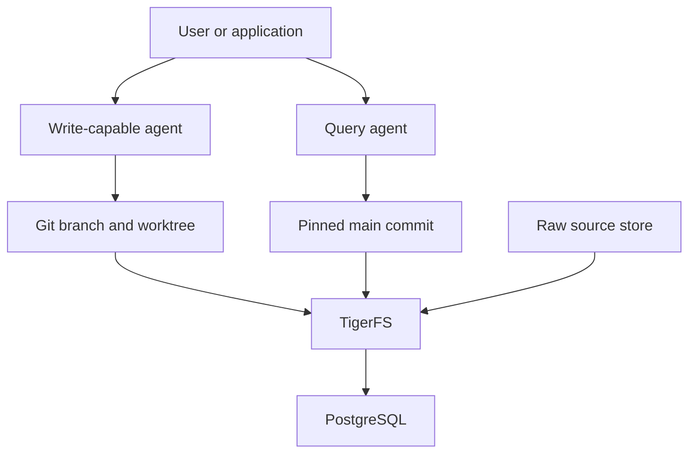
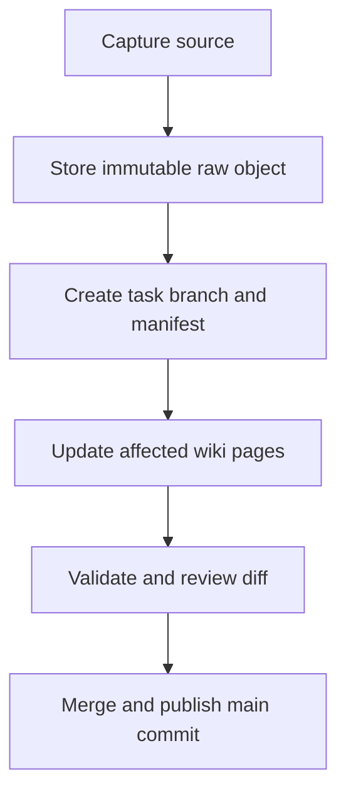

# AI Knowledge Base Architecture

**Status:** Proposed Architecture  
**Date:** 4 August 2026  
**Primary stack:** PostgreSQL, TigerFS, Git worktrees, Markdown, YAML  
**Knowledge model:** Karpathy-style LLM Wiki

## 1. Executive Summary

This document defines a simple, multi-agent knowledge base built from three complementary ideas:

1. **PostgreSQL is the physical system of record.** All persistent files are stored as PostgreSQL-backed TigerFS rows.
2. **Git is the logical publication and collaboration layer.** Branches isolate agent work, worktrees provide independent working directories, commits identify coherent knowledge-base revisions, and `main` represents the published wiki.
3. **The LLM Wiki is the knowledge model.** Immutable raw sources are incrementally compiled into a structured, interlinked, LLM-maintained wiki instead of being rediscovered from raw RAG chunks for every question.

The central design rule is:

> Raw sources preserve evidence; the wiki preserves synthesized knowledge; Git preserves intent and publication history; TigerFS and PostgreSQL preserve bytes and transactional file operations.

Each write-capable agent receives its own Git branch and linked worktree. Agents never edit the published branch directly. A serialized release process validates and merges accepted changes into `main`. Query agents pin a `main` commit at the beginning of a request and read that immutable Git tree, which prevents them from observing a partially updated multi-file wiki.

Search remains deliberately simple at first: `index.md`, wikilinks, `git grep`, and direct page reads. BM25, vector search, and graph indexes may be added later as disposable projections keyed by Git commit. They are candidate-discovery mechanisms, never independent sources of truth.

## 2. Goals

The architecture must provide:

- a human-readable Markdown knowledge base;
- immutable and traceable source evidence;
- isolated concurrent work for multiple agents;
- reviewable multi-file changes;
- stable snapshots for queries and releases;
- conflict detection and controlled merging;
- PostgreSQL-backed persistence and backup;
- compatibility with standard agent file tools;
- low operational complexity for the first production version;
- a path to better retrieval without changing the canonical data model.

## 3. Non-Goals

The first version does not attempt to provide:

- a general-purpose distributed POSIX filesystem;
- automatic semantic merging of contradictory agent edits;
- an autonomous agent swarm with unrestricted write access;
- a separate vector database, graph database, event bus, or cache cluster;
- full GitHub- or GitLab-style pull-request infrastructure;
- direct answering from low-confidence retrieval fragments;
- permanent storage of derived indexes or agent context caches.

## 4. Architectural Principles

### 4.1 Separate physical persistence from logical publication

PostgreSQL, through TigerFS, stores the bytes. Git defines which coherent set of bytes is published. These are different responsibilities and should not be conflated.

| Concern | Authority |
|---|---|
| Persistent bytes and filesystem operations | PostgreSQL + TigerFS |
| Immutable source evidence | Content-addressed raw store |
| Published knowledge snapshot | Git commit referenced by `refs/heads/main` |
| Isolated agent changes | Git branch + linked worktree |
| Knowledge organization and maintenance rules | `AGENTS.md` |
| Search results and embeddings | Rebuildable projection keyed by commit SHA |
| Runtime tasks and leases | Control workspace or PostgreSQL tables |

### 4.2 Compile knowledge at ingestion time

New material is not merely indexed. An ingest/compiler agent reads it, identifies the affected concepts and entities, reconciles it with existing knowledge, records contradictions, and updates several wiki pages in one branch.

This makes the wiki a persistent, compounding artifact. Query-time work becomes navigation and synthesis over maintained knowledge rather than repeated reconstruction from arbitrary chunks.

### 4.3 Treat branches as drafts

There is no permanent `drafts/` copy of the wiki. A task branch is the draft. A worktree is the agent's isolated editing surface. The Git diff is the proposal, and the merge commit is the accepted knowledge transaction.

### 4.4 Publish by immutable commit

Query agents must not use a mutable release worktree as their read source. At the start of each query they resolve and pin the current `main` SHA, then read from that Git tree for the entire request.

This gives snapshot consistency without requiring TigerFS to provide a cross-file transaction for the whole wiki. Git may write objects and files in several operations, but the branch reference acts as the publication pointer. Objects written before a failed reference update are unreachable and do not become published knowledge.

### 4.5 Retrieval finds pages; pages provide evidence

Lexical or vector search should return candidate page identities. The agent then reads the complete wiki pages and, when necessary, their cited raw sources. Search fragments should not be treated as facts or directly packed into the answer context.

## 5. System Context



### 5.1 PostgreSQL

PostgreSQL is the only durable storage service required by the core design. It stores TigerFS workspaces, Git repository files, raw-source objects, and optional control data. Standard PostgreSQL backup, point-in-time recovery, replication, monitoring, and access control apply.

### 5.2 TigerFS

TigerFS exposes PostgreSQL-backed rows as files and directories. The knowledge system uses it in file-first mode so existing agents and Unix tools can operate through familiar file APIs.

Use separate TigerFS workspaces for different write patterns:

| Workspace | Format | TigerFS history | Purpose |
|---|---|---:|---|
| `kb-git` | `plaintext` | Disabled | Bare Git repository and linked worktrees |
| `kb-raw` | Binary-capable/plain files | Disabled | Immutable, content-addressed source objects |
| `kb-control` | `markdown` | Optional | Tasks, leases, audit notes, and operational state |

TigerFS history should be disabled for `kb-git`. Git already versions repository content; enabling both systems would record every Git object, lockfile, ref update, and packfile rewrite twice, creating storage and write amplification without improving branch semantics.

### 5.3 Git

Git provides the collaboration semantics that TigerFS intentionally does not provide natively:

- branches for isolated intent;
- linked worktrees for independent agent directories;
- commits for coherent proposed changes;
- diffs for review;
- three-way merges and explicit conflicts;
- revert, cherry-pick, and rollback;
- an immutable commit tree for consistent reads.

A shared bare repository is preferable to a conventional main worktree because no ordinary agent needs to edit `main` directly.

### 5.4 LLM Wiki

The repository contains the LLM-maintained wiki, source manifests, schema rules, validation rules, and change log. Raw bytes may be stored separately to avoid materializing large PDFs, audio, video, and images into every linked worktree.

### 5.5 Agents

Agent roles are permission and workflow modes, not necessarily separate services.

| Role | Default access | Responsibility |
|---|---|---|
| Ingest agent | Append raw; write task branch | Register a source, create its manifest, extract relevant information |
| Compiler agent | Write task branch | Integrate a source into existing wiki pages and syntheses |
| Query agent | Read pinned commit | Answer from the published wiki with source traceability |
| Lint agent | Read all; write repair branch | Detect broken links, unsupported claims, duplicates, contradictions, and stale pages |
| Release agent | Update `main` | Validate, review, merge, and publish accepted changes |

For the first version, one worker process may perform ingest, compile, and lint modes. Only the release path requires separate authority.

## 6. Physical Layout

The following layout is mounted from one PostgreSQL database through TigerFS:

```text
/mnt/ai-kb/
├── kb-git/
│   ├── knowledge.git/                 # shared bare Git repository
│   └── worktrees/
│       ├── release/                   # release agent only
│       ├── agent-01-task-184/
│       ├── agent-02-task-185/
│       └── lint-task-186/
│
├── kb-raw/
│   └── sha256/
│       └── ab/
│           └── cd/
│               └── <full-sha256>      # immutable source bytes
│
└── kb-control/
    ├── queue/
    ├── leases/
    ├── completed/
    └── failed/
```

The same TigerFS mount path should be used on every machine that shares linked worktrees. Git worktree administrative metadata may contain paths to its common Git directory; inconsistent mount paths create avoidable portability failures.

## 7. Git Repository Layout

```text
knowledge.git tree at main
├── AGENTS.md
├── README.md
├── sources/
│   ├── index.md
│   └── manifests/
│       └── <source-id>.yaml
├── wiki/
│   ├── index.md
│   ├── log.md
│   ├── concepts/
│   ├── entities/
│   ├── topics/
│   ├── claims/
│   ├── questions/
│   └── syntheses/
├── schemas/
│   ├── wiki-page.schema.json
│   └── source-manifest.schema.json
└── checks/
    ├── validate-frontmatter
    ├── validate-links
    ├── validate-sources
    └── validate-index
```

### 7.1 Why raw bytes are outside the Git tree

Git is an excellent version store for text, but linked worktrees materialize tracked files. Keeping large immutable source binaries in the Git tree would duplicate them across worktrees and make object maintenance unnecessarily expensive.

The recommended model is:

- store each raw object once under a SHA-256 path in `kb-raw`;
- keep its metadata and checksum in a Git-tracked source manifest;
- cite the stable source ID from wiki pages;
- verify the raw object's checksum during validation;
- prohibit update and delete operations in the raw PostgreSQL table through database permissions or a trigger.

Small text sources may be stored directly in Git if operational simplicity is more valuable than uniformity. The manifest remains the stable citation identity in either case.

## 8. Data Model

### 8.1 Source manifest

```yaml
id: source.2026-08-04.karpathy-llm-wiki
title: LLM Wiki
source_type: web
original_url: https://gist.github.com/karpathy/442a6bf555914893e9891c11519de94f
captured_at: 2026-08-04T06:00:00Z
raw_uri: tigerfs://kb-raw/sha256/ab/cd/<sha256>
sha256: <sha256>
media_type: text/markdown
status: active
```

The manifest is versioned because metadata and interpretation may improve. The referenced raw bytes remain immutable.

### 8.2 Wiki page

```markdown
---
id: concept.kv-cache
page_type: concept
status: active
updated_at: 2026-08-04
confidence: high
sources:
  - source.paper.attention-scaling
  - source.conversation.kv-cache-2026-08-04
related:
  - concept.prefill
  - topic.long-context
supersedes: []
---

# KV Cache

## Definition

...

## Current Understanding

...

## Disputed or Uncertain Points

...

## Evidence

- [source.paper.attention-scaling](../../sources/manifests/source.paper.attention-scaling.yaml)
```

### 8.3 Knowledge categories

| Category | Purpose |
|---|---|
| `concepts/` | Definitions and technical mechanisms |
| `entities/` | People, organizations, products, places, or systems |
| `topics/` | Broad navigational overviews |
| `claims/` | Specific testable statements with evidence and confidence |
| `questions/` | Open questions, evidence gaps, and planned research |
| `syntheses/` | Cross-source analyses and evolving conclusions |

Categories should remain few and stable. A page identity must not depend on its current directory, because pages may be reorganized without changing what they represent.

### 8.4 Epistemic separation

Every page must distinguish among:

- source-reported facts;
- direct observations;
- user opinions or preferences;
- agent inferences;
- disputed claims;
- unknowns and evidence gaps.

An agent must not silently promote an inference or a user's belief into an established fact. If the wiki lacks a confident answer, the query agent should say so; that low-confidence answer must not be filed back as knowledge without new evidence or explicit review.

## 9. Branch and Worktree Model

### 9.1 Naming

```text
main
agent/<agent-id>/<task-id>-<slug>
lint/<task-id>-<slug>
repair/<task-id>-<slug>
```

Examples:

```text
agent/ingest-01/184-add-attention-paper
agent/compiler-02/185-update-long-context
lint/186-repair-orphan-links
```

### 9.2 One branch and worktree per task

Each write task receives:

- the `main` commit SHA used as its base;
- a unique branch;
- a unique linked worktree;
- an explicit set of expected pages or topics;
- a lease with an expiry time;
- a validation and review result.

Multiple agents must never share one worktree. A branch without a separate worktree is insufficient because checkout state, the index, and uncommitted files are worktree state.

### 9.3 Short-lived branches

Branches should normally live for minutes or hours, not weeks. Long-lived knowledge branches accumulate stale assumptions and make semantic reconciliation harder. Agents should rebase or regenerate a proposal when the published wiki has materially changed.

### 9.4 Main-branch authority

Only the release agent may update `refs/heads/main`. Other agents can create commits and branches but cannot publish. This boundary should be enforced by process credentials and database or mount permissions where possible, not only by instructions in `AGENTS.md`.

## 10. Core Workflows

### 10.1 Ingest and compile



Detailed sequence:

1. Compute the source SHA-256 before storage.
2. Insert the raw object using a create-only operation.
3. Create a source manifest in a new task branch.
4. Read `AGENTS.md` and the pinned base version of `wiki/index.md`.
5. Identify the smallest relevant set of existing pages.
6. Update summaries, concepts, entities, claims, contradictions, and links as required.
7. Update `wiki/index.md` and append a structured entry to `wiki/log.md`.
8. Run deterministic validation.
9. Commit the complete proposal with the source ID and task ID in the message.
10. Review the diff for semantic and citation quality.
11. Merge through the release queue.
12. Atomically advance `main` only if it still equals the expected base SHA.
13. Invalidate or build derived indexes for the new commit SHA.

### 10.2 Query

1. Resolve `refs/heads/main` once and pin the returned commit SHA.
2. Read `wiki/index.md` from that commit.
3. Navigate by page IDs, wikilinks, and exact lexical search.
4. Read complete candidate pages, not only matching lines.
5. Follow source manifests and raw evidence when the claim requires verification.
6. Answer with citations and confidence calibrated to the stored evidence.
7. If the answer produces a durable new synthesis, open a normal task branch; never write directly to `main` during the query.

Useful snapshot-safe operations include:

```bash
git --git-dir=/mnt/ai-kb/kb-git/knowledge.git rev-parse refs/heads/main
git --git-dir=/mnt/ai-kb/kb-git/knowledge.git show "$COMMIT_SHA:wiki/index.md"
git --git-dir=/mnt/ai-kb/kb-git/knowledge.git grep -n "KV Cache" "$COMMIT_SHA" -- wiki/
```

### 10.3 Lint

Linting has two layers.

Deterministic checks detect:

- invalid YAML or schema violations;
- duplicate stable IDs;
- missing source manifests or raw objects;
- checksum mismatches;
- unresolved wikilinks;
- pages absent from `index.md`;
- malformed log entries;
- edits that violate raw immutability.

Semantic checks detect:

- contradictions not explicitly marked;
- conclusions unsupported by cited evidence;
- stale claims superseded by newer sources;
- duplicate pages with diverging interpretations;
- orphan concepts that should be promoted to pages;
- overconfident language unsupported by source quality.

Semantic lint findings should normally produce a report or repair branch, not direct edits to `main`.

### 10.4 Release

The release queue serializes publication:

1. Confirm that the proposed branch has a known base SHA.
2. Rebase or merge against the latest `main` in the release worktree.
3. Resolve textual conflicts.
4. Run deterministic and semantic validation again.
5. Create the final merge or squash commit.
6. Update `refs/heads/main` using compare-and-swap semantics against the expected old SHA.
7. Record the published commit and validation result.
8. Remove the task worktree and, after the retention period, the branch.

Textual conflict resolution is not sufficient. The reviewer must also ask whether two independently valid edits changed the same conclusion, confidence level, or source interpretation.

## 11. Retrieval Strategy

### 11.1 Stage 1: navigation without RAG infrastructure

Use:

- `wiki/index.md` as the content-oriented catalog;
- `wiki/log.md` as the chronological activity record;
- stable page IDs and wikilinks;
- `git grep` or `rg` for exact lexical discovery;
- full-page reads followed by source verification.

This is the default until scale and measured retrieval failures justify additional infrastructure.

### 11.2 Stage 2: derived hybrid retrieval

When the wiki reaches a scale where index-first navigation is insufficient, build a derived index:

```text
Git main commit SHA
        ↓
Page parser and link extractor
        ↓
BM25 + vector + typed-link projections
        ↓
Candidate page IDs
        ↓
Rerank and read complete pages from the same commit
```

Every index must record the source commit SHA. A query must not combine an index generated from commit A with wiki pages from commit B. Indexes may be deleted and rebuilt without data loss.

### 11.3 Context-noise controls

- Apply workspace, status, page-type, and time filters before semantic ranking.
- Retrieve candidate pages before retrieving passages.
- Limit the number of complete pages read in one step.
- Require a reranking or navigation decision before expanding raw sources.
- Do not mix fragments from multiple commits.
- Do not file answers produced from weak or low-relevance matches.

## 12. Concurrency and Consistency

| Scenario | Mechanism |
|---|---|
| Agents edit different topics | Independent branches and worktrees |
| Agents edit the same page | Git merge conflict plus semantic review |
| Two releases race | Compare-and-swap update of `main` ref |
| Query overlaps a release | Query pins one immutable commit |
| Agent crashes before commit | Uncommitted task worktree survives; `main` is unchanged |
| Git writes objects but fails before ref update | Objects remain unreachable; published state is unchanged |
| PostgreSQL transaction fails | TigerFS file operation fails atomically |
| Derived index is stale | Commit-SHA mismatch rejects the index |

TigerFS protects individual file operations through PostgreSQL transactions. Git protects publication by writing new objects first and advancing a reference last. Together, these mechanisms are sufficient for coherent snapshots, provided TigerFS correctly implements the filesystem primitives on which Git relies.

## 13. Security and Permissions

- Use a distinct PostgreSQL role or mount credential for release operations.
- Give ordinary agents no authority to update or delete raw-source rows.
- Enforce raw immutability with database privileges or a trigger, not prompt instructions alone.
- Keep credentials, API tokens, and private keys outside the knowledge repository.
- Record agent identity, task ID, base commit, result commit, and validation outcome.
- Restrict `main` publication to the release agent.
- Prefer read-only access for query agents.
- Treat TigerFS `user_id` as audit metadata unless access enforcement is independently verified.

## 14. Backup and Recovery

### 14.1 Required controls

- PostgreSQL base backups and WAL archiving;
- tested point-in-time recovery;
- periodic logical export of source manifests and wiki Git bundles;
- scheduled `git fsck` against the bare repository;
- checksum audit of raw objects;
- restore drills on a separate PostgreSQL instance.

### 14.2 Recovery objectives

| Failure | Recovery method |
|---|---|
| Bad wiki merge | Git revert or reset through a new audited release |
| Deleted task branch | Recover from reflog if retained, otherwise from backup |
| Corrupt Git object | Restore database/PITR or Git bundle |
| Corrupt raw source | Restore by SHA-256 from backup |
| TigerFS process failure | Restart and remount; PostgreSQL remains authoritative |
| Database loss | Restore base backup and replay WAL |

Do not use TigerFS history as the primary backup of the Git workspace. It is not a substitute for PostgreSQL recovery or Git-level integrity checks.

## 15. Operational Simplicity

The minimum production topology is:

```text
One PostgreSQL instance
One TigerFS mount service per agent host
One shared bare Git repository
One worktree per write task
One serialized release worker
One backup and validation schedule
```

No Redis, Kafka, Elasticsearch, Qdrant, Neo4j, Gitea, or custom knowledge API is required initially. A small PostgreSQL control table or TigerFS task directory is sufficient for task state and leases.

## 16. Critical Compatibility Gate: Git on TigerFS

This architecture intentionally places the Git repository inside TigerFS, but this must be treated as a tested deployment assumption rather than an established production guarantee.

TigerFS documentation specifies that ordinary dotfiles and directories such as `.git/` are allowed, that user files can be stored in file-first workspaces, and that binary file bodies may be encoded for PostgreSQL storage. However, TigerFS does not currently publish a formal Git compatibility guarantee or a comprehensive Git workload benchmark.

Before production use, verify at least:

- exclusive lockfile creation;
- atomic rename and replace;
- close-to-open visibility across mounts;
- correct binary round trips for loose objects and packfiles;
- file truncation and append behavior;
- `fsync` and crash behavior;
- concurrent ref updates;
- `git worktree add`, `move`, `remove`, and `prune`;
- `git commit`, merge, rebase, cherry-pick, and revert;
- `git gc`, repack, and prune;
- database restart during Git writes;
- TigerFS process termination during ref updates;
- `git fsck` after every destructive failure test.

The production gate should run with the expected repository size, network latency, number of agents, and PostgreSQL configuration. If correctness passes but performance is weak, use local ephemeral object caches or fewer persistent worktrees before adding more infrastructure.

If correctness fails, do not attempt to repair Git semantics in the agent layer. Move the bare Git repository to a filesystem with certified Git behavior and keep TigerFS/PostgreSQL as the raw and control store. That fallback changes the physical single-source-of-truth decision and therefore requires an explicit architecture review.

## 17. Performance Expectations and Tests

Git creates many small objects and performs frequent metadata operations. A database-backed FUSE path may make `status`, checkout, worktree creation, and garbage collection more sensitive to network latency than ordinary local storage.

Benchmark the following at 1,000, 10,000, and 100,000 wiki pages:

- cold and warm `git status`;
- branch and worktree creation;
- a 15-page ingest commit;
- a large directory refactor;
- concurrent commits from 4, 16, and 64 agents;
- conflicting and non-conflicting merges;
- snapshot query latency with `git show` and `git grep`;
- `git gc` and repack duration;
- PostgreSQL WAL growth and storage amplification;
- backup and full restore time;
- raw-object checksum audit throughput.

Initial optimization order:

1. keep PostgreSQL and agent hosts on a low-latency network;
2. use a shared bare repository and linked worktrees to avoid duplicate object stores;
3. keep branches short-lived;
4. remove idle worktrees;
5. exclude large raw binaries from the Git tree;
6. add ephemeral local read caches keyed by commit SHA;
7. add derived search only after measuring navigation failures.

## 18. Implementation Plan

### Phase 0: compatibility proof

- Deploy PostgreSQL and TigerFS on Linux.
- Create a `plaintext` workspace without TigerFS history.
- Run the Git compatibility and crash-recovery test matrix.
- Measure metadata latency and WAL amplification.

**Exit criterion:** all integrity tests pass and `git fsck` remains clean after failure injection.

### Phase 1: single-agent wiki

- Create the bare repository and one release worktree.
- Add `AGENTS.md`, source manifests, wiki directories, schemas, and validators.
- Implement immutable raw storage by SHA-256.
- Support ingest, query, and lint manually through one agent.

**Exit criterion:** 100 representative sources can be ingested and queried with traceable citations.

### Phase 2: multi-agent branches

- Add task branches and one linked worktree per write task.
- Add leases, branch naming, validation reports, and cleanup.
- Serialize release through one worker.
- Pin query agents to a commit SHA.

**Exit criterion:** concurrent writers cannot expose partial or unreviewed changes to queries.

### Phase 3: retrieval projection

- Measure index-first and lexical retrieval failures.
- Add hybrid retrieval only if justified.
- Key every projection by commit SHA.
- Add page-level reranking and complete-page expansion.

**Exit criterion:** retrieval improves recall without increasing unsupported answers or cross-commit inconsistency.

### Phase 4: production hardening

- Add PostgreSQL PITR, replica, monitoring, and restore drills.
- Add semantic regression tests and source-integrity audits.
- Load-test the expected agent concurrency.
- Document operational limits and failure procedures.

## 19. Architecture Decisions

| Decision | Rationale |
|---|---|
| PostgreSQL is the durable store | Centralized ACID persistence, backup, access control, and shared multi-host state |
| TigerFS is the file interface | Agents can use existing file tools without a custom knowledge API |
| Git lives inside TigerFS, subject to a compatibility gate | Preserves branches, worktrees, diffs, and commit snapshots while retaining PostgreSQL persistence |
| A bare repository is shared | Linked worktrees reuse one object database and avoid a mutable main worktree |
| One task equals one branch and worktree | Isolates uncommitted state and agent intent |
| `main` is the published wiki | A single understandable publication line limits knowledge drift |
| Queries pin a commit | Prevents partial multi-file reads during releases |
| Raw bytes are content-addressed outside Git | Avoids worktree duplication and preserves immutable evidence |
| Source manifests are Git-tracked | Metadata and citations evolve with the wiki while raw bytes do not |
| TigerFS history is disabled for Git data | Avoids redundant versioning and write amplification |
| Search indexes are disposable | Prevents retrieval infrastructure from becoming a competing truth source |
| Branches replace a persistent drafts directory | Avoids two draft mechanisms and preserves proper merge semantics |

## 20. Final Recommendation

Build the first version as a trunk-oriented LLM Wiki with short-lived agent branches:

```text
PostgreSQL
└── TigerFS
    ├── content-addressed immutable raw sources
    ├── bare Git repository
    │   ├── AGENTS.md
    │   ├── source manifests
    │   └── maintained Markdown wiki
    ├── one linked worktree per write task
    └── lightweight task and lease state
```

Use Git commits, not TigerFS savepoints, as knowledge publication transactions. Use TigerFS and PostgreSQL for persistence, filesystem access, and operational recovery. Let only a release process advance `main`, and make every query operate against a pinned commit.

The design stays simple because each layer has one job. Its main unresolved risk is not the knowledge model but the filesystem contract between Git and TigerFS. Validate that contract first; once it passes, the rest of the architecture can evolve incrementally without replacing the canonical Markdown wiki.

## References

1. Andrej Karpathy, [LLM Wiki](https://gist.github.com/karpathy/442a6bf555914893e9891c11519de94f).
2. Timescale, [TigerFS repository and overview](https://github.com/timescale/tigerfs).
3. Timescale, [TigerFS file-first mode](https://github.com/timescale/tigerfs/blob/main/docs/file-first.md).
4. Timescale, [TigerFS complete specification](https://github.com/timescale/tigerfs/blob/main/docs/spec.md).
5. Git, [git-worktree documentation](https://git-scm.com/docs/git-worktree).

